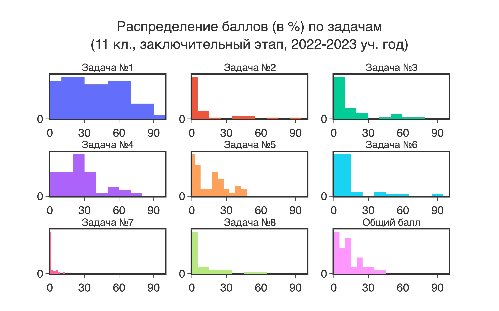
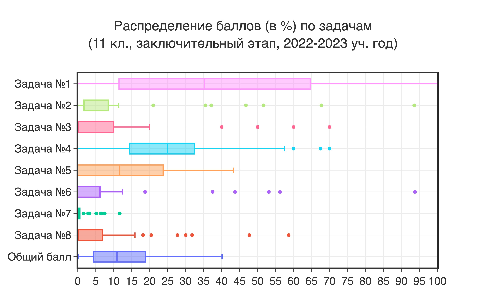
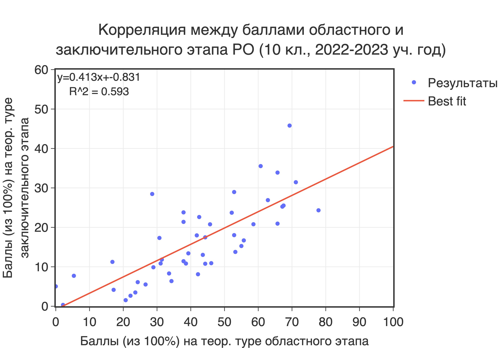
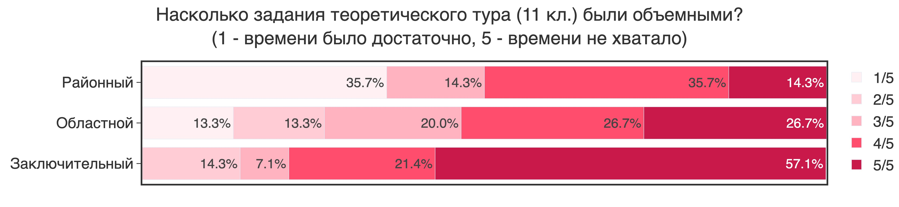
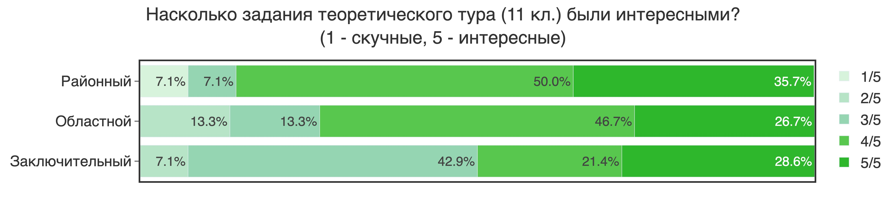

# Республиканские олимпиады по химии в цифрах

## Введение

Когда в начале 2019 года меня пригласили быть руководителем сборной РК по химии, я с удивлением обнаружил, что несмотря на то, что республиканская олимпиада школьников по химии (и связанные с ней мероприятия) проходит уже почти 30 лет, у руководителей сборной нет никаких данных, на которые можно было бы опираться при принятии решений. Мы не могли ответить на элементарные вопросы: насколько хорошо ученики справлялись с похожими заданиями в предыдущие годы? Насколько хорошо они пишут районную олимпиаду? А областную? Насколько хорошо областная олимпиада готовит учеников к заключительному этапу? А кто участвует на каждом этапе? Какое распределение по школам? Как много учеников неспециализированных школ? Насколько осведомлены участники разных этапов о доступных для них ресурсах?

Хочется верить, что за почти 5 лет вовлеченности в олимпийское движение, я смог хоть немного, но уменьшить долю хаоса и увеличить количество структурированной информации. Текущий документ - попытка свести собранную информацию об участниках РО в единый документ, в надежде, что последующие руководители сборных смогут пользоваться им для принятия *data-driven decisions*.

Если вы предпочитаете изучать информацию самостоятельно, все графики находятся в папке [export](export/). В папке [latex-report](latex-report/) вы найдете единый [PDF документ](latex-report/ro2023report.pdf) со всеми графиками и сопроводительным текстом.

## Highlights

